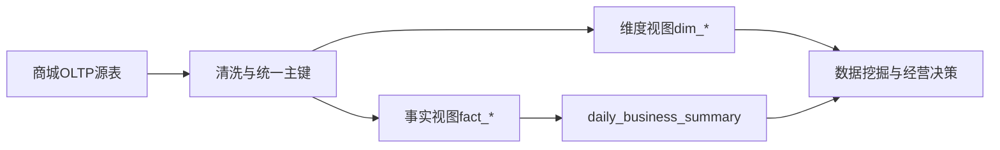

# 商城源系统到数据集映射

本文档说明在线商城 OLTP 表如何映射为数据挖掘课程使用的 DIM/FACT 数据集。学生可以直接查询分析视图，也可以基于本映射理解 ETL 口径。

## 总体链路

## 维度映射

| 分析维度 | 来源表 | 主键 | 说明 |
|---|---|---|---|
| `dim_date` | `orders`、`page_events`、`ads_spend`、`refunds` | `date_id` | 从业务发生日期去重生成 |
| `dim_product` | `sku` + `spu` + `categories` | `sku_id` | 商品类目、品牌、价格、成本、供应商、价格带 |
| `dim_user` | `users` | `user_id` | 地区、注册渠道、生命周期分群、会员等级 |
| `dim_campaign` | `campaigns` | `campaign_id` | 活动类型、渠道、目标人群、对照组标记、预算 |

## 事实映射

| 事实表 | 来源表 | 粒度 | 适合问题 |
|---|---|---|---|
| `fact_order` | `orders` | 一行一订单 | GMV、客单、复购、活动订单 |
| `fact_order_item` | `order_items` + `orders` | 一行一订单明细 | 品类贡献、毛利、关联规则、长尾 |
| `fact_traffic` | `page_events` | 一行一事件 | 漏斗、路径、未转化会话、渠道转化 |
| `fact_coupon_use` | `user_coupons` + `coupons` | 一行一张用户券 | 发放、未使用、核销、券敏感 |
| `fact_refund` | `refunds` + `orders` | 一行一退款 | 退款原因、售后风险 |
| `fact_fulfillment` | `shipments` + `orders` | 一行一包裹 | 配送时效、延迟、履约体验 |
| `fact_inventory_movement` | `inventory_movements` | 一行一库存流水 | 补货、销售出库、动销 |
| `fact_product_review` | `product_reviews` | 一行一评论 | 评分、情感、体验标签 |
| `fact_ads_spend` | `ads_spend` | 一行一活动每日投放 | CTR、CPA、ROAS |

## 教学建议

- 入门层：用 `daily_business_summary`、`fact_order`、`dim_product` 完成经营日报。
- 诊断层：用 `fact_traffic` + `fact_order` 分析漏斗损失。
- 建模层：用 `dim_user` + `fact_order` + `fact_coupon_use` 做复购/券敏感模型。
- 决策层：用 `fact_ads_spend` + `dim_campaign` + `fact_order` 做预算迁移和活动复盘。

## 不建议学生直接修改的表

- `orders`
- `order_items`
- `payments`
- 历史 `page_events`

学生管理端若需要记录运营动作，应新增活动、标签、备注或写入 `admin_action_logs`，避免破坏历史数据口径。
